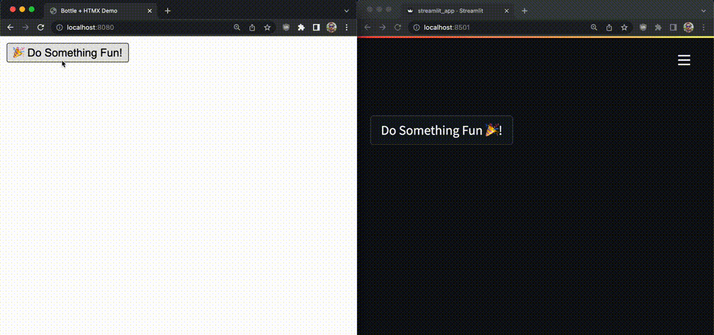
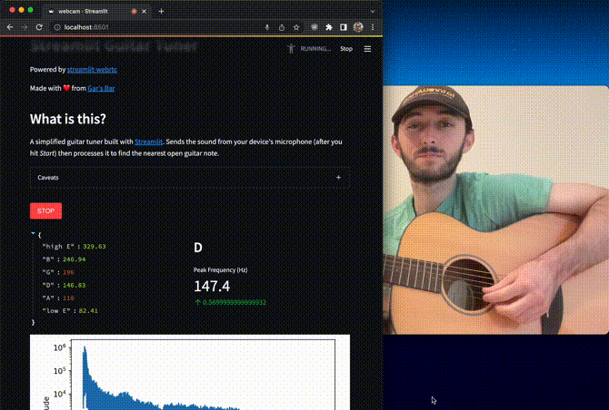
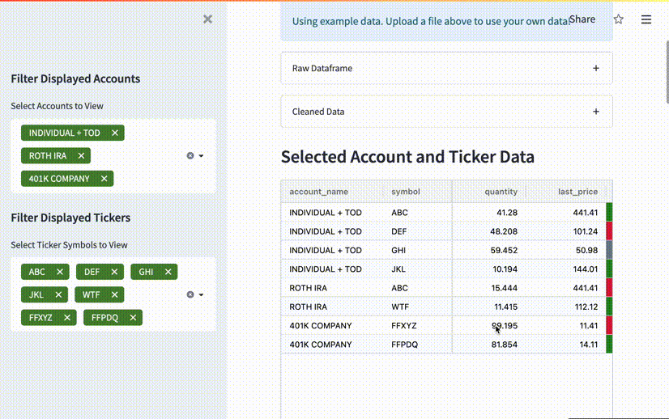
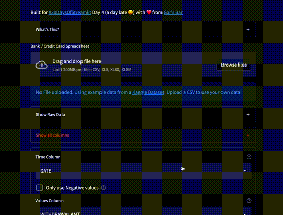
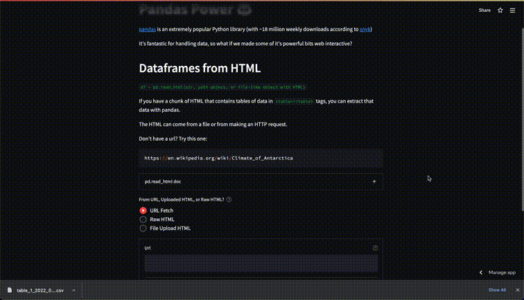
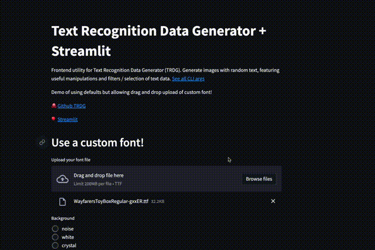
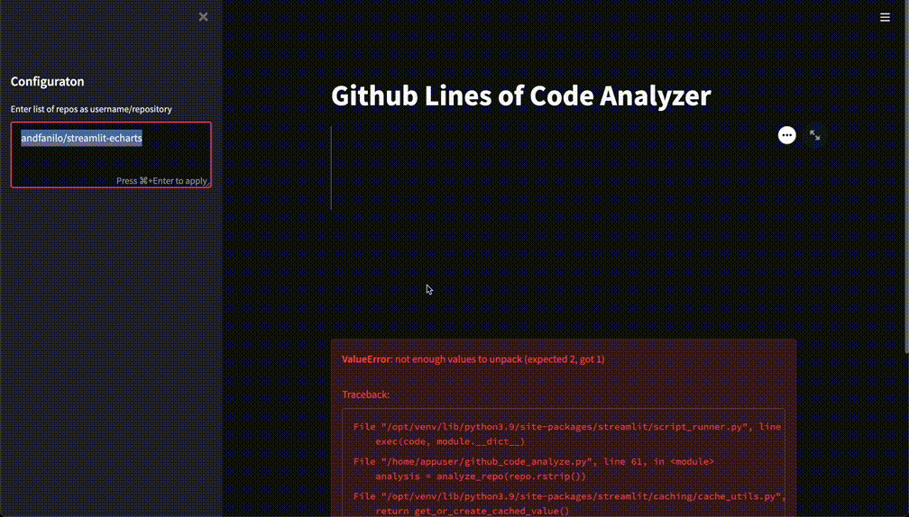
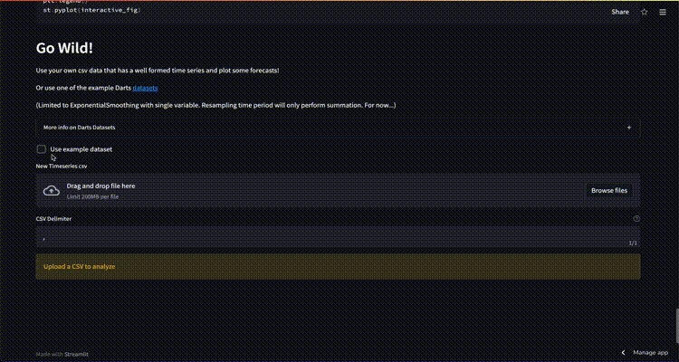
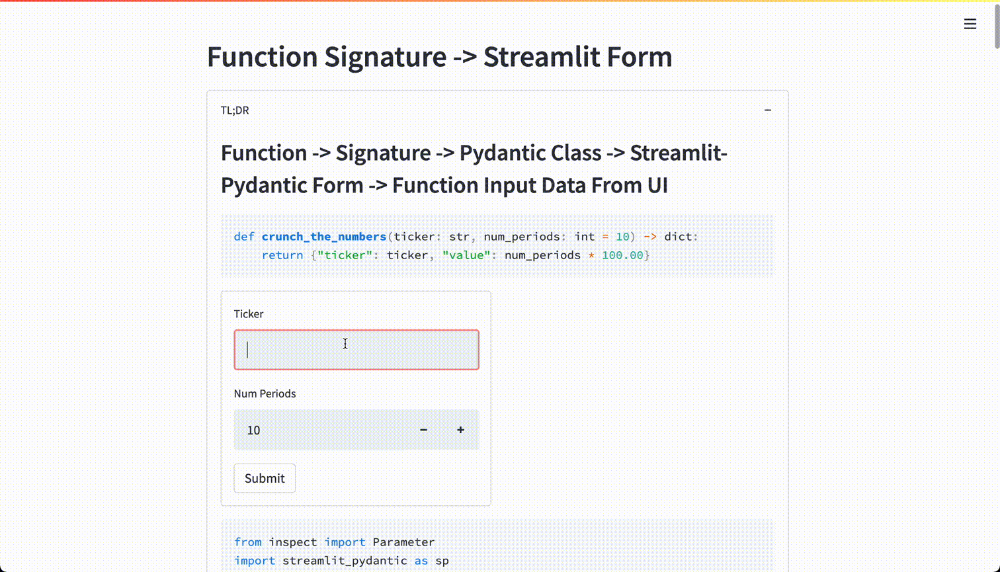

# Streamlit Random Apps

Made with :heart: from [Gar's Bar](https://tech.gerardbentley.com/)

- [Streamlit Random Apps](#streamlit-random-apps)
  - [:dart: Darts API Playground](#dart-darts-api-playground)
  - [:link: URL Scanner](#link-url-scanner)
  - [🥞 WSGI Stack vs Streamlit](#-wsgi-stack-vs-streamlit)
  - [🎸 Guitar Tuner](#-guitar-tuner)
  - [:computer: Streamlit Full Stack 3 Ways](#computer-streamlit-full-stack-3-ways)
      - [:mouse: Littlest](#mouse-littlest)
      - [:elephant: Postgres Version](#elephant-postgres-version)
      - [:rat: Go Backend Version](#rat-go-backend-version)
  - [:chart_with_upwards_trend: Fidelity / Personal Stock Account Dashboard](#chart_with_upwards_trend-fidelity--personal-stock-account-dashboard)
  - [:mount_fuji: Peak Weather: NH 4,000 Footers](#mount_fuji-peak-weather-nh-4000-footers)
  - [🐼 Pandas Power](#-pandas-power)
  - [✍🏻 Text Recognition Dataset Generator App](#-text-recognition-dataset-generator-app)
  - [🐙 Github Lines of Code Analyzer](#-github-lines-of-code-analyzer)
  - [:books: AWS Textract Document Text Scan](#books-aws-textract-document-text-scan)
  - [:moneybag: Roommate Spending Ledger Visualization](#moneybag-roommate-spending-ledger-visualization)
  - [Darts Intro](#darts-intro)
  - [Function to Streamlit Form](#function-to-streamlit-form)
  - [PDF Merge and Split Utility](#pdf-merge-and-split-utility)
  - [Python Web Form Generator](#python-web-form-generator)
  - [Basic File Drop](#basic-file-drop)
  - [Gif Maker](#gif-maker)

## :dart: Darts API Playground

[](https://share.streamlit.io/gerardrbentley/darts-playground/main)

Explore the Datasets, Metrics, and Models of the Darts Time Series library.

See: [Github Repo](https://github.com/gerardrbentley/darts-playground)


## :link: URL Scanner

[](https://share.streamlit.io/gerardrbentley/streamlit-url-scanner/main/streamlit_app/streamlit_app.py)

Using AWS Rekognition + Streamlit to provide interactive OCR URL Scanner / Text Extraction on real world images.

See: [Github Repo](https://github.com/gerardrbentley/streamlit-url-scanner)


## 🥞 WSGI Stack vs Streamlit

Comparing an interactive web app built with `bottle` + `htmx` to the same idea built with `streamlit`.

In folder `wsgi_comparison`

🎥 Watch: [Youtube Breakdown](https://www.youtube.com/watch?v=4V3VACzOmrI&t=2s)
✍🏻 Read: [Blog Post](https://tech.gerardbentley.com/streamlit/python/beginner/2022/03/23/bottle-htmx-streamlit.html)

Left: ~50 lines of Python and HTML

Right: ~15 lines of Python



## 🎸 Guitar Tuner

Simple guitar tuner powered by `streamlit-webrtc`



## :computer: Streamlit Full Stack 3 Ways

Demo of Full Stack Streamlit Concept.
Deployed with 3 increasingly complicated backends.

See: [Github Repo](https://github.com/gerardrbentley/streamlit-fullstack)

#### :mouse: Littlest

[](https://share.streamlit.io/gerardrbentley/streamlit-fullstack/app.py)

#### :elephant: Postgres Version

[](https://streamlit-postgres.gerardbentley.com/)

#### :rat: Go Backend Version

[](https://st-pg-go.gerardbentley.com/)

## :chart_with_upwards_trend: Fidelity / Personal Stock Account Dashboard

[](https://share.streamlit.io/gerardrbentley/fidelity-account-overview/main/app.py)

Upload a CSV export from Fidelity investment account(s) and visualize profits and losses from select tickers and accounts.

See: [Github Repo](https://github.com/gerardrbentley/fidelity-account-overview)



## 💰 Personal Spending Dashboard

[](https://share.streamlit.io/gerardrbentley/streamlit-random/main/personal_spending.py)

Upload a CSV or excel with at least a date column and spending amount column to analyze maximum and average spending over different time periods.




## :mount_fuji: Peak Weather: NH 4,000 Footers

[](https://share.streamlit.io/gerardrbentley/peak-weather/main/streamlit_app/streamlit_app.py)

Use async http request library `httpx` to make 48 api calls roughly simultaneously in one Python process.
Feed a dashboard of weather for all 4,000 foot mountains in New Hampshire.

See: [Github Repo](https://github.com/gerardrbentley/peak-weather)

## 🐼 Pandas Power

[](https://share.streamlit.io/gerardrbentley/streamlit-random/main/pandas_power.py)

Demoing useful functionalities of Pandas library in a web app.

Currently:

- `read_html`: Parse dataframes from html (url, upload, or raw copy+paste)



## ✍🏻 Text Recognition Dataset Generator App

Putting a frontend on TRDG CLI tool.
Primary goal: creating classic videogame text screenshots with known ground truth labels



## 🐙 Github Lines of Code Analyzer

Shallow clone a repo then use unix + pandas tools to count how many lines of each file type are present

`streamlit run github_code_analyze.py`



## :books: AWS Textract Document Text Scan

[](https://share.streamlit.io/gerardrbentley/textract-streamlit-example/main/streamlit_app/streamlit_app.py)

Using AWS Textract + S3 + Streamlit to provide interactive OCR Web App.

See: [Github Repo](https://github.com/gerardrbentley/textract-streamlit-example)

## :moneybag: Roommate Spending Ledger Visualization

[](https://share.streamlit.io/gerardrbentley/roommate-ledger/main/app.py)

Using Pandas + Plotly + SQLite to show a full stack use case of Time Series Data.
Analyze spending over time per person (could be adapted to categories / tags / etc).

See: [Github Repo](https://github.com/gerardrbentley/roommate-ledger)

## Darts Intro

[](https://share.streamlit.io/gerardrbentley/timeseries-examples/main/streamlit_apps/02_darts.py)

~1 for 1 exploration of Darts quick start with Streamlit + some interactive forecasting of Uploaded CSV.

Exploring Time Series in: [Github Repo](https://github.com/gerardrbentley/timeseries-examples)



## Function to Streamlit Form

[](https://share.streamlit.io/gerardrbentley/streamlit-random/main/st_func_form.py)

Powered by `Streamlit-Pydantic`.
Utilizes `inspect.signature` to build an input class to a function definition.

What's the point?

Even more rapid development!

Take any CLI or other functional API and create an input form for them.
Encourage developers to write accurate type hints ;)



```py
from inspect import Parameter
import streamlit as st
import streamlit_pydantic as sp
from inspect import signature
from pydantic import create_model


def crunch_the_numbers(ticker: str, num_periods: int = 10) -> dict:
    return {"ticker": ticker, "value": num_periods * 100.00}

pydantic_fields = {
    x.name: (
        (x.annotation, ...)
        if x.default == x.empty
        else (x.annotation, x.default)
    )
    for x in signature(crunch_the_numbers).parameters.values()
}
PydanticFormModel = create_model("PydanticFormModel", **pydantic_fields)

input_col, output_col = st.columns(2)
with input_col:
    data = sp.pydantic_form(key="some_form", model=PydanticFormModel)
if data:
    output_col.json(crunch_the_numbers(**data.dict()))
```

## PDF Merge and Split Utility

[](https://share.streamlit.io/gerardrbentley/streamlit-random/main/pdf_merge_and_split.py)

Powered by `pypdf2` library, feel free to use reportlab or something else.

JPG or PNG output optionally, powered by `pdf2image` (requires `brew insall poppler` / `apt install poppler-utils` or `conda install -c conda-forge poppler`? [github](https://github.com/Belval/pdf2image))

Combines multiple PDFs into a single PDF or splits a single PDF into multiple PDFs.


## Python Web Form Generator

[](https://share.streamlit.io/gerardrbentley/python-form-generator/main/app.py)

Powered by `Streamlit-Pydantic`.
Generate a Streamlit web form UI + Pydantic models from an example JSON data structure.

See: [Github Repo](https://github.com/gerardrbentley/python-form-generator)

## Basic File Drop

Not live, as there is no point.

Make a web frontend that you can access from local network and drop any number of files to host computer!
All in ~10 lines of code.


```py
import streamlit as st
from pathlib import Path

files = st.file_uploader("uploads", accept_multiple_files=True)
destination = Path('downloads')
destination.mkdir(exist_ok=True)

for f in files:
    bytes_data = f.read()
    st.write("filename:", f.name)
    st.write(f"{len(bytes_data) = }")
    new_file = destination / f.name
    new_file.write_bytes(bytes_data)
```

## Gif Maker

[](https://share.streamlit.io/gerardrbentley/gif-maker/main)
